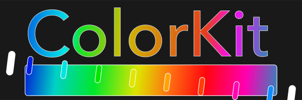
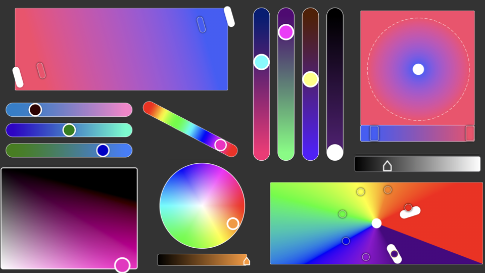

<p align="center">


<p align="center">
    
    
    
    
</p>

**Color Kit** is a brand new SwiftUI library with the goal of providing all the essential building blocks to make the most *epic* color picking experience. Built with the developer in mind **Color Kit** has a simple API while still retaining the infinitely customizable components you need!


<p align="center">

</p>

## Why Use Color Kit?

* You need to make the best color picking experience possible
* You need the flexibility of cascading styles
* You need to make your app quickly and with minimal headaches
* You need to export your creations into code that works instantly

## What Components Does Color Kit Provide?

* **Color Pickers**
  * **RGB**
  * **RGBA**
  * **HSB**
  * **HSBA**
  * **CMYK**
  * **Gray Scale**
  * **All In One**
* **Gradient Pickers**
  * **Linear**
  * **Radial**
  * **Angular**
  * **All In One**
* **Data Objects**
  * `ColorToken`
  * `GradientData`

## Getting Started

### Method 1

Adding **Color Kit** as a dependency to an existing project

1. Copy that URL from the github repo
2. In Xcode -> File -> Swift Packages -> Add Package Dependencies
3. Paste the URL Into the box
4. Specify the minimum version number 1.0.2
5. Add `import ColorKit` to the top of the file you are adding a picker to.
6. Follow the implementation steps for the picker you wish to use (these will generally be found in the top level comments for the picker, you can also find them in the readme)


### Method 2

Clone the [example project](https://github.com/kieranb662/Color-Kit-Examples) and play around with all the different examples to get a feel for the library. If you are really feeling adventurous try making your own custom styles for one of the gradient pickers. Its super easy and **Color Kit** even comes with snippets to help get you started.


## Components

### ColorToken

`ColorToken` is a data object used to store the various color values that could be used with the pickers. I wont go into the possible initializers here, but I implore you to take a look at the source code. The values stored within `ColorToken` are:

* `id: UUID` - a unique identifier created at initialization
* `dateCreated: Date` - a timestamp created at initialization
* `name: String` - The name you specify for the color (**Default**: "New")
* `colorFormulation: ColorFormulation` - An enumeration describing which type of color is being used rgb, hsb, cmyk, grayscale
* `rgbColorSpace: RGBColorSpace` - A wrapper enum for SwiftUI's RGBColorSpace (**Default**: sRGB)
* `white: Double` - white value used with grayscale should be between 0 and 1 (**Default**: 0.5)
* `red: Double` - red value used with RGB should be between 0 and 1 (**Default**: 0.5)
* `green: Double` - green value used with RGB should be between 0 and 1 (**Default**: 0.5)
* `blue: Double` - blue value used with RGB should be between 0 and 1 (**Default**: 0.5)
* `hue: Double` - hue value used with HSB should be between 0 and 1 (**Default**: 0.5)
* `saturation: Double` - saturation value used with HSB should be between 0 and 1 (**Default**: 0.5)
* `brightness: Double` - brightness value used with HSB should be between 0 and 1 (**Default**: 0.5)
* `cyan: Double` - cyan value used with CMYK should be between 0 and 1 (**Default**: 0.5)
* `magenta: Double` - magenta value used with CMYK should be between 0 and 1 (**Default**: 0.5)
* `yellow: Double` - yellow value used with CMYK should be between 0 and 1 (**Default**: 0.5)
* `keyBlack: Double` - keyBlack value used with CMYK should be between 0 and 1 (**Default**: 0.5)
* `alpha: Double` - alpha value used with any type of color formulation should be between 0 and 1 (**Default**: 1)


SwiftUI's `Color` can be easily be generated by accessing `ColorToken.color` value.

## Color Pickers

Each of the various color pickers and sliders are really just styled version of components from the [Sliders](https://github.com/kieranb662/Sliders) library.

<p align="center">


</p>


### Alpha Slider

A pre-styled Slider used to change the alpha/opacity of a `ColorToken` The `AlphaSlider` view is really just a styled `LSlider` with a custom binding to a `ColorToken`

<p align="center">


### RGB Sliders

A set of pre-styled RGB sliders that contain a gradient representing the color if that slider was dragged to either of its limits. The `RGBColorPicker` view is really just 3 styled `LSlider`'s with a custom binding to a `ColorToken`

<p align="center">


### Saturation Brightness TrackPad

A styled `TrackPad` that uses two composited linear gradients to get the desired 2D saturation brightness gradient effect

<p align="center">


### Hue Slider

A styled `LSlider` with a background gradient representing a full hue rotation.

<p align="center">


### CMYK Sliders

Conceptually similar to the RGB Sliders. These represent the values of a CMYK color

<p align="center">


### Bonus Circular HSB Picker

This one isn't a part of the library but is available as an example implementation within the **ColorKitExamples** project. It makes use of an `MTKView` to from the MetalKit framework to draw the circular gradient.

<p align="center">


## Gradient Pickers

### Linear

A Component view used to create and style a `Linear Gradient` to the users liking.
The sub components that make up the gradient picker are
1. **Gradient**: The Linear gradient containing view
2. **Start Handle**: A draggable view representing the start location of the gradient
3. **End Handle**: A draggable view representing the end location of the gradient
4. **LinearStop**: A draggable view  representing a gradient stop that is constrained to be located within the start and and handles locations

<p align="center">


**Important**: You must create a `GradientManager` `ObservedObject` and then apply it to the `LinearGradientPicker` or the view containing it using the `environmentObject` method

#### Styling The Picker
In order to style the picker you must create a struct that conforms to the `LinearGradientPickerStyle` protocol. Conformance requires the implementation of 4 separate methods. To make this easier just copy and paste the following style based on the `DefaultLinearGradientPickerStyle`. After creating your custom style
  apply it by calling the `linearGradientPickerStyle` method on the `LinearGradientPicker` or a view containing it.

````Swift

  struct <#My Picker Style#>: LinearGradientPickerStyle {

     func makeGradient(gradient: LinearGradient) -> some View {
            RoundedRectangle(cornerRadius: 5)
                .fill(gradient)
                .overlay(RoundedRectangle(cornerRadius: 5).stroke(Color.white))
        }

      func makeStartHandle(configuration: GradientHandleConfiguration) -> some View {
          Capsule()
              .foregroundColor(Color.white)
              .frame(width: 25, height: 75)
              .rotationEffect(configuration.angle + Angle(degrees: 90))
              .animation(.none)
              .shadow(radius: 3)
              .opacity(configuration.isHidden ? 0 : 1)
      }

      func makeEndHandle(configuration: GradientHandleConfiguration) -> some View {
          Capsule()
              .foregroundColor(Color.white)
              .frame(width: 25, height: 75)
              .rotationEffect(configuration.angle + Angle(degrees: 90))
              .animation(.none)
              .shadow(radius: 3)
              .opacity(configuration.isHidden ? 0 : 1)
      }

      func makeStop(configuration: GradientStopConfiguration) -> some View {
          Capsule()
              .foregroundColor(configuration.color)
              .frame(width: 20, height: 55)
              .overlay(Capsule().stroke( configuration.isSelected ? Color.yellow : Color.white ))
              .rotationEffect(configuration.angle + Angle(degrees: 90))
              .animation(.none)
              .shadow(color: configuration.isSelected ? Color.white : Color.black, radius: 3)
              .opacity(configuration.isHidden ? 0 : 1)

      }
  }

````

### Radial


 A Component view used to create and style a `RadialGradient` to the users liking.
 The sub components that make up the gradient picker are
 1. **Gradient**: The Radial Gradient containing view
 2. **Center Thumb**: A draggable view representing the center of the gradient
 3. **StartHandle**: A draggable circle representing the start radius  that grows larger/small as you drag away/closer from the center thumb
 4. **EndHandle**: A draggable circle representing the end radius  that grows larger/small as you drag away/closer from the center thumb
 5. **RadialStop**: A draggable view contained to the gradient bar, represents the unit location of the stop
 6. **Gradient Bar**: A slider like container filled with a linear gradient created with the gradient stops.

 <p align="center">
 

 **Important**: You must create a `GradientManager` `ObservedObject` and then apply it to the `RadialGradientPicker`
   or the view containing it using the `environmentObject` method


  ## Styling The Picker
 In order to style the picker you must create a struct that conforms to the `RadialGradientPickerStyle` protocol. Conformance requires the implementation of
  6 separate methods. To make this easier just copy and paste the following style based on the `DefaultRadialGradientPickerStyle`. After creating your custom style
  apply it by calling the `radialGradientPickerStyle` method on the `RadialGradientPicker` or a view containing it.

````Swift
  struct <#My Picker Style#>: RadialGradientPickerStyle {

       func makeGradient(gradient: RadialGradient) -> some View {
           RoundedRectangle(cornerRadius: 5)
               .fill(gradient)
               .overlay(RoundedRectangle(cornerRadius: 5).stroke(Color.white))
       }

      func makeCenter(configuration: GradientCenterConfiguration) -> some View {
          Circle().fill(configuration.isActive ? Color.yellow : Color.white)
              .frame(width: 35, height: 35)
              .opacity(configuration.isHidden ? 0 : 1)
              .animation(.easeIn)
      }

      func makeStartHandle(configuration: GradientHandleConfiguration) -> some View {
          Circle()
              .stroke(Color.white.opacity(0.001), style: StrokeStyle(lineWidth: 10))
              .overlay(Circle().stroke(Color.black, style: StrokeStyle(lineWidth: 1, dash: [10, 5])))
              .opacity(configuration.isHidden ? 0 : 1)
              .animation(.easeIn)
      }

      func makeEndHandle(configuration: GradientHandleConfiguration) -> some View {
          Circle()
              .stroke(Color.white.opacity(0.001), style: StrokeStyle(lineWidth: 10))
              .overlay(Circle().stroke(Color.white, style: StrokeStyle(lineWidth: 1, dash: [10, 5])))
              .opacity(configuration.isHidden ? 0 : 1)
              .animation(.easeIn)
      }

      func makeStop(configuration: GradientStopConfiguration) -> some View {
          Group {
              if !configuration.isHidden {
                  RoundedRectangle(cornerRadius: 5)
                      .foregroundColor(configuration.color)
                      .frame(width: 25, height: 45)
                      .overlay(RoundedRectangle(cornerRadius: 5).stroke( configuration.isSelected ? Color.yellow : Color.white ))
                      .shadow(color: configuration.isSelected ? Color.white : Color.black, radius: 3)
                      .transition(AnyTransition.opacity)
                      .animation(Animation.easeOut)
              }
          }
      }

      func makeBar(configuration: RadialGradientBarConfiguration) -> some View {
          Group {
              if !configuration.isHidden {
                  RoundedRectangle(cornerRadius: 5)
                      .fill(LinearGradient(gradient: configuration.gradient, startPoint: .leading, endPoint: .trailing))
                      .overlay(RoundedRectangle(cornerRadius: 5).stroke(Color.white))
                      .transition(AnyTransition.move(edge: .leading))
                      .animation(Animation.easeOut)
              }
          }
      }
  }
 ````

### Angular

 A Component view used to create and style an `AngularGradient` to the users liking
  The sub components that make up the gradient picker are
  1. **Gradient**: The Angular Gradient containing view
  2. **Center Thumb**: A draggable view representing the location of the gradients center
  3. **Start Handle**: A draggable view representing the start location of the gradient
  4. **End Handle**: A draggable view representing the end location of the gradient
  5. **AngularStop**: A draggable view  representing a gradient stop that is constrained to be between the current stop and end angles locations

  <p align="center">
  

 **Important**: You must create a `GradientManager` `ObservedObject` and then apply it to the `AngularGradientPicker`
   or the view containing it using the `environmentObject` method

  ## Styling The Picker

 In order to style the picker you must create a struct that conforms to the `AngularGradientPickerStyle` protocol. Conformance requires the implementation of
 4 separate methods. To make this easier just copy and paste the following style based on the `DefaultAngularGradientPickerStyle`. After creating your custom style
 apply it by calling the `angularGradientPickerStyle` method on the `AngularGradientPicker` or a view containing it.

```Swift
struct <#My Picker Style#>: AngularGradientPickerStyle {

   func makeGradient(gradient: AngularGradient) -> some View {
       RoundedRectangle(cornerRadius: 5)
           .fill(gradient)
           .overlay(RoundedRectangle(cornerRadius: 5).stroke(Color.white))
   }

    func makeCenter(configuration: GradientCenterConfiguration) -> some View {
        Circle().fill(configuration.isActive ? Color.yellow : Color.white)
            .frame(width: 35, height: 35)
            .opacity(configuration.isHidden ? 0 : 1)
    }

    func makeStartHandle(configuration: GradientHandleConfiguration) -> some View {
        Capsule()
            .foregroundColor(Color.white)
            .frame(width: 30, height: 75)
            .rotationEffect(configuration.angle)
            .animation(.none)
            .shadow(radius: 3)
            .opacity(configuration.isHidden ? 0 : 1)
    }

    func makeEndHandle(configuration: GradientHandleConfiguration) -> some View {
        Capsule()
            .foregroundColor(Color.white)
            .frame(width: 30, height: 75)
            .rotationEffect(configuration.angle)
            .animation(.none)
            .shadow(radius: 3)
            .opacity(configuration.isHidden ? 0 : 1)
    }

    func makeStop(configuration: GradientStopConfiguration) -> some View {
        Group {
            if !configuration.isHidden {
                Circle()
                    .foregroundColor(configuration.color)
                    .frame(width: 25, height: 45)
                    .overlay(Circle().stroke( configuration.isSelected ? Color.yellow : Color.white ))
                    .shadow(color: configuration.isSelected ? Color.white : Color.black, radius: 3)
                    .transition(AnyTransition.opacity)
                    .animation(Animation.easeOut)
            }
        }
    }
}
 ```
